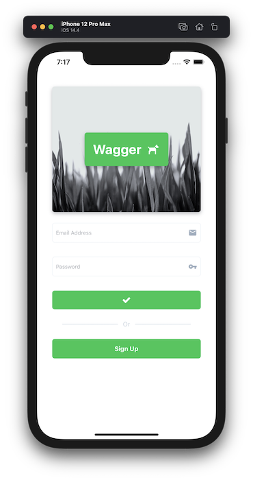
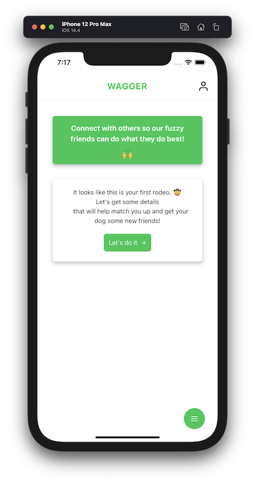

# Wagger 🐶

Bring dogs together time and time again. Users can sign up to add their dogs, create dog playdates, and join playdates created by others.

This project started as a Ruby on Rails and JavaScript web application that I built a couple of years ago. After moving deeper into the React ecosystem, I decided to reboot the idea as way to learn React Native.

What can I say? I love dogs!

## Front End

- React Native
- React Native Router Flux for navigation
- Apollo Client for data queries and mutations
- AWS Cognito and Amplify for authorization and authentication
- AWS Lambda for data events
- Magnus UI for building the UI
- React Hook Form and Yup for forms and validation

## Back End

- PostgreSQL database through Heroku
- Hasura GraphQL API

## Linting and formatting

- ESLint
- Prettier for JavaScript formatting
- Pylint
- Black for Python formatting

## Screenshots

   
  

## ERD

### Created with DBeaver v7.3.4

